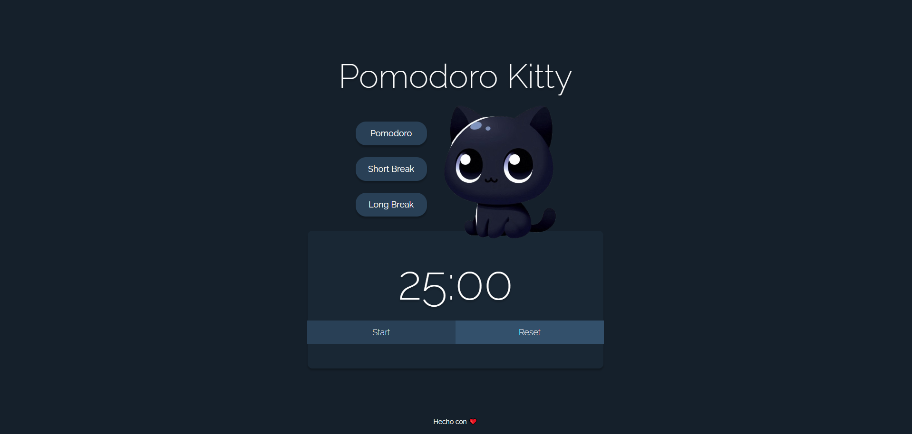
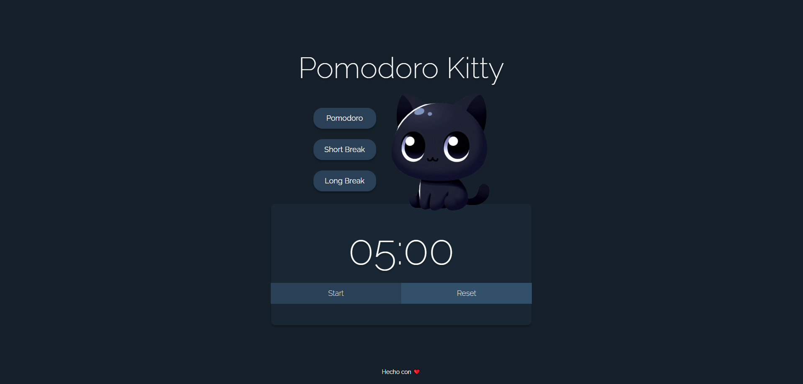

# Pomodoro Kitty

Pomodoro Kitty es una aplicación web sencilla para gestionar temporizadores estilo Pomodoro con modos para trabajo y descansos. Ayuda a mejorar la productividad y mantener el enfoque.

---

## 🚀 Características

- Temporizadores para:
  - Pomodoro: 25 minutos
  - Short Break: 5 minutos
  - Long Break: 15 minutos
- Botón **Start / Pause** para controlar el temporizador
- Botón **Reset** para reiniciar el temporizador
- Notificaciones visuales y sonido cuando termina el tiempo
- Diseño responsivo y amigable con ilustración de gato

---

## 📁 Estructura del proyecto
```plaintext
/index.html Archivo HTML principal
/styles.css Estilos CSS
/script.js Lógica JavaScript
/assets/ Imágenes y sonidos
```

---

## 🎯 Cómo usar

1. Clona o descarga el repositorio
2. Abre `index.html` en tu navegador favorito
3. Selecciona el modo de temporizador que quieras (Pomodoro, Short Break o Long Break)
4. Usa los botones para iniciar, pausar o reiniciar el temporizador
5. Al finalizar el tiempo, sonará una alerta y se mostrará una notificación visual

---

## 🌐 Acceso Online

El proyecto está publicado y disponible para usar online gracias a GitHub Pages. Puedes acceder directamente en:
`https://agosro.github.io/pomodoro-kitty/`

---

## 🛠 Tecnologías

- HTML5
- CSS3 (variables CSS, Flexbox)
- JavaScript (ES6)
- Audio HTML5 para alertas

---
## Capturas de pantalla

Te mostramos cómo se ve **Pomodoro Kitty** en acción:






---

## 🚀 Posibles mejoras futuras

- **Diseño Responsive:** Adaptar la interfaz para que funcione bien y se vea bien en dispositivos móviles y tablets.
- **Contador de Ciclos:** Añadir un indicador visual que muestre cuántos pomodoros y descansos se han completado.
- **Personalización de Colores:** Permitir que el usuario elija o cambie la paleta de colores para una experiencia más personalizada.
- **Configuración de Tiempos:** Que el usuario pueda definir la duración de pomodoro, descansos cortos y largos según sus preferencias.
- **Notificaciones Avanzadas:** Incorporar notificaciones del sistema o alertas sonoras configurables para mayor comodidad.
- **Guardar Estado:** Guardar el progreso del temporizador en localStorage para que no se pierda al recargar la página.
- **Estadísticas:** Mostrar estadísticas diarias o semanales para ayudar al usuario a hacer seguimiento de su productividad.
- **Modo Oscuro/Claro:** Agregar toggle para alternar entre modo oscuro y claro.
- **Animaciones y Efectos:** Mejorar la experiencia visual con animaciones suaves cuando se inicie o termine un ciclo.
- **Atajos de Teclado:** Para iniciar, pausar o resetear el temporizador sin usar el mouse.

---

## 🤝 Créditos

Creado por Agostina Torres ❤️

---

¡Disfruta organizando tu tiempo con Pomodoro Kitty! 😺⏳

---
